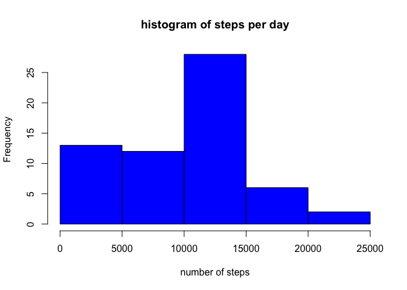
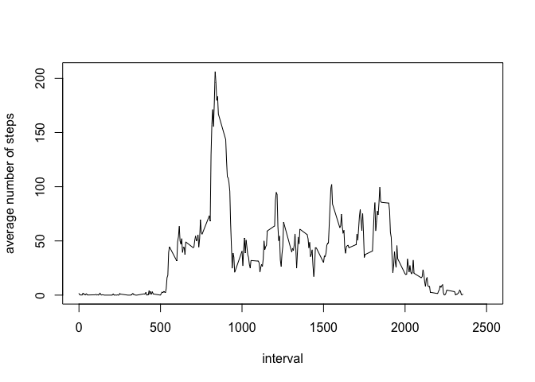
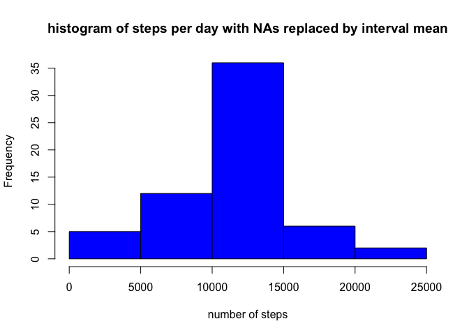
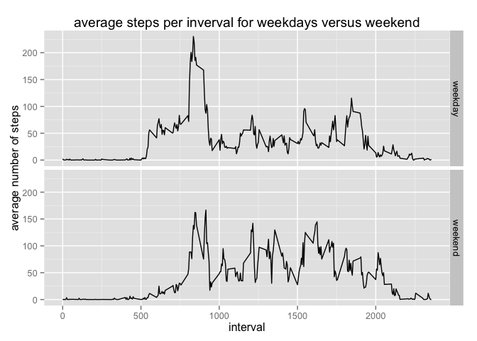

# Reproducible Research: Peer Assessment 1
Mark Schroeder  
January 15, 2015  

This document processes the data for the first Peer Assessment in the Coursera class Reproducible Research.

## Loading and preprocessing the data

```r
#load data
setwd("~/Google Drive/dataScience/ReproducibleResearch/RepData_PeerAssessment1")
unzip("activity.zip")
library(dplyr)
```

```
## 
## Attaching package: 'dplyr'
## 
## The following object is masked from 'package:stats':
## 
##     filter
## 
## The following objects are masked from 'package:base':
## 
##     intersect, setdiff, setequal, union
```

```r
data <- read.table("activity.csv", header=TRUE, sep=",")
```


## What is mean total number of steps taken per day?

```r
#group data and do requested calculations
by_date <- group_by(data, date)
steps <- summarise(by_date, sum_steps = sum(steps, na.rm = TRUE))
mean_steps <- mean(steps$sum_steps)
mean_display <- sprintf("%.1f", mean_steps)
median_steps <- median(steps$sum_steps)

#plot histogram of number of steps per day
hist(steps$sum_steps, col="blue", xlab="number of steps",
     main="histogram of steps per day")
```

 
<br>
The mean number of steps per day is 9354.2.
The median number of steps per day is 10395.

## What is the average daily activity pattern?

```r
#group data and do requested calculations
by_interval <- group_by(data, interval)
daily_activity <- summarise(by_interval, ave_steps = mean(steps, na.rm = TRUE))

max_steps <- max(daily_activity$ave_steps)
log_index <- daily_activity$ave_steps == max_steps
max_interval <- daily_activity$interval[log_index]

#plot average number of steps per interval
plot(daily_activity$interval, daily_activity$ave_steps, type="l", col="black", 
     xlab="interval", ylab="average number of steps", xlim=c(0,2500))
```

 
<br>
The maximum number of steps is 206.1698113 that occurs in interval 835.

## Imputing missing values

```r
#do requested calculations to handle the NA/missing values
na_count <- sum(is.na(data$steps))
na_mean <- data
for (i in unique(data$interval)) {
      na_mean$steps[is.na(data$steps) & data$interval == i] <- 
            mean(data$steps[data$interval==i],  na.rm = TRUE)
      }

by_date_na <- group_by(na_mean, date)
steps_na <- summarise(by_date_na, sum_steps = sum(steps, na.rm = TRUE))
mean_steps_na <- mean(steps_na$sum_steps)
mean_display_na <- sprintf("%.1f", mean_steps_na)
median_steps_na <- median(steps_na$sum_steps)
median_display_na <- sprintf("%.1f", median_steps_na)

#plot histogram of steps per day with NAs replaced
hist(steps_na$sum_steps, col="blue", xlab="number of steps",
     main="histogram of steps per day with NAs replaced by interval mean")
```

 

The number of NAs in the data set is 2304.  When NAs are replaced by the interval mean, the mean number of steps is 10766.2 and the median number of steps is 10766.2.

## Are there differences in activity patterns between weekdays and weekends?

```r
#set up new factor variable weekday by making date a factor and using the weekdays
#function
library(lubridate)
date_data <- na_mean
date_data$date <- ymd(date_data$date)
date_data <- mutate(date_data, weekday = weekdays(date), weekend = 
             ifelse(weekday == "Sunday" | weekday == "Saturday", "weekend", "weekday"))
date_data$weekend <- as.factor(date_data$weekend)
date_data <- group_by(date_data, weekend, interval)
steps_weekend_vs_weekday <- summarise(date_data, ave_steps = mean(steps))

#Use ggplot to plot the average steps by weekday versus weekend
#esthetics dictate using ggplot instead of lattice plot - please don't dock points!
library(ggplot2)
g <- ggplot(steps_weekend_vs_weekday, aes(interval, ave_steps))
print(g + geom_line() + facet_grid(weekend ~ .) + 
      labs(y = "average number of steps") + labs(x = "interval" )
      + labs(title = "average steps per inverval for weekdays versus weekend"))
```

 


